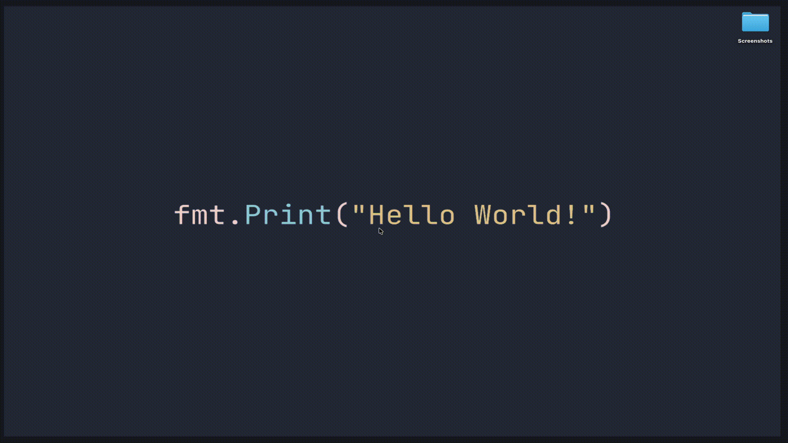

<h1 align="center">⌘ Keybindings</h1>

This little utility app is build to show your (favorite) keybindings in a small, searchable window. Just start the app
and search for the keybinding/shortcut you are looking for. With `Command + K` you can toggle the window, so that
you have an easy shortcut to quickly search.

<h2>📸 Demo</h2>



<h2>💻 Installation</h2>

**Mac**

```bash
brew tap daschaa/tap
brew install --cask keybindings
```

**Other**

Download the latest release from the [releases](https://github.com/daschaa/keybindings/releases/latest)

<h2>Customize Keybindings</h2>

The app loads with an example set of keybindings. To customize it and set your own keybindings you can edit the file
in `~/.keybindings/shortcuts.json`. The format should be a list of objects with the `shortcut` and the `description`.
Like so:

```json
[
  {
    "shortcut": "COMMAND + F",
    "description": "Search for"
  },
  {
    "shortcut": "COMMAND + T",
    "description": "[Firefox] New Tab"
  }
]
```

<h2>Run on Mac</h2>

> [!NOTE]  
> This is only needed if you downloaded the app from the releases page. If you installed it via Homebrew, you can skip this step.

The app is not signed and need to be taken out of quarantine in order to run the app. You can do that with the
following command:

```bash
xattr -d com.apple.quarantine keybindings.app
```

<h2>👯 Contribute</h2>

Any contribution is welcome. New features are not likely to be integrated, because I want to keep it simple and clean.

**Features that would be cool (imo):**

- Make list of shortcuts interactive and execute them when selected (and Enter pressed)
- Create list of shortcuts on first startup, by selecting OS + apps that you use